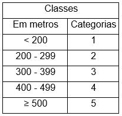
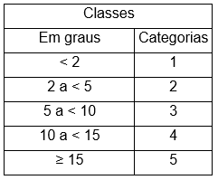
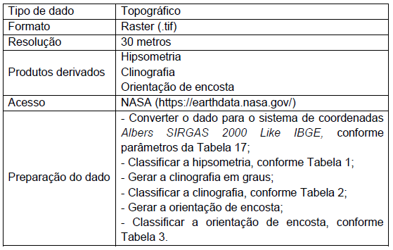
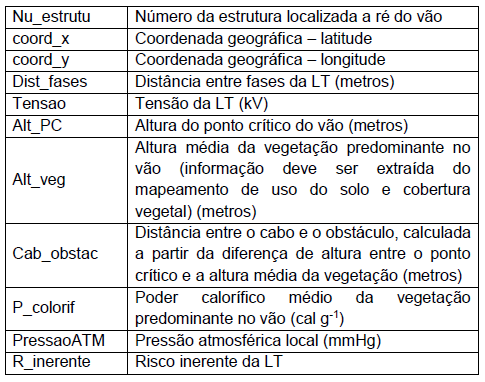
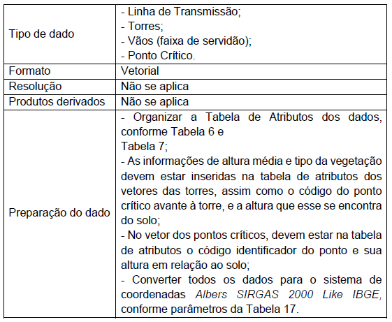
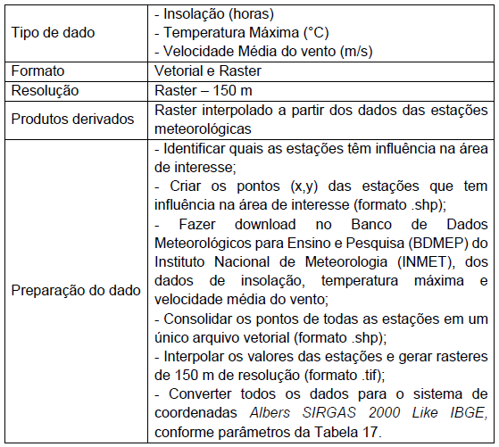
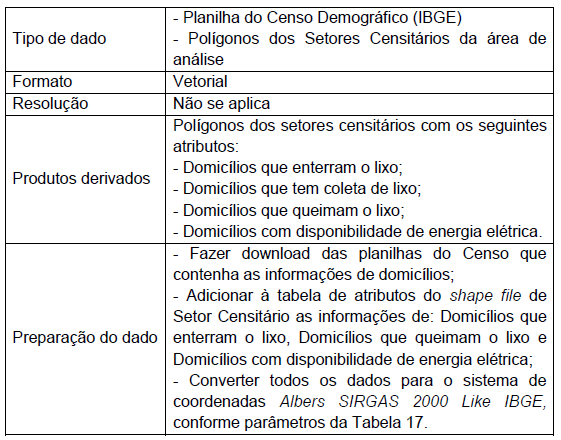
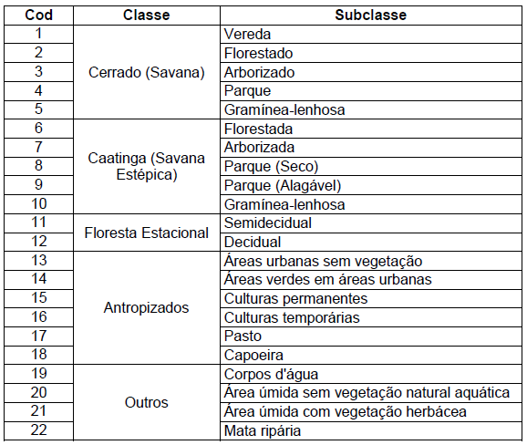
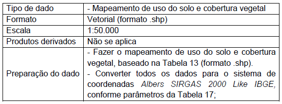
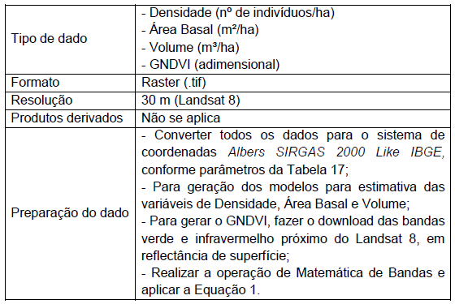

# 3   DADOS DE ENTRADA

## *3.1. Dados topográficos*

Os dados topográficos foram obtidos a partir do MDT (Modelo Digital de Terreno) do Projeto *Shuttle Radar Topography Mission* (SRTM) produzido pela NASA com resolução espacial de 30 m (os dados encontram-se disponíveis em: https://earthdata.nasa.gov/).

Os dados SRTM (formato .tif) apresentam em suas células o valor referente à altitude. Desta forma, para a obtenção da hipsometria, basta efetuar a classificação do arquivo, escolhendo o intervalo de classes que for mais conveniente para a execução do trabalho.

Para o modelo aplicado na ATE II foram duas formas de utilização dos dados de hipsometria. O dado separado de 100 em 100 metros, com as áreas menores que 200 metros de altitude, foram agrupadas em uma classe, e as áreas superiores a 500 metros em outra (Tabela 1). Foi utilizado o dado também sem a classificação dos valores, com o valor absoluto.

Tabela 1: Classes de hipsometria

A Clinografia se refere às diferentes declividades e aclividades do terreno, sendo possível obter essa informação em porcentagem ou em graus. Nos dados SRTM, se refere ao valor clinográfico predominante em uma célula de 30 por 30 metros.

Para o modelo aplicado na área da ATE II, as classes em graus em valores absolutos são agrupadas pelo plugin da seguinte forma (Tabela 2):

Tabela 2: Classes clinográficas

A orientação de vertentes é a informação que demonstra o ângulo azimutal da maior inclinação do terreno no sentindo descendente, expressa em graus de 0° a 360º. Ela define a orientação de vertente predominante na célula do SRTM em graus que variam de -1 (plano) e de 0 a 360º.

Cada faixa de graus pode ser associada a pontos cardeais e colaterais sendo 0°/360º o Norte, 90º o Leste, 180º o Sul e 270º o Oeste. Para o presente modelo a classificação realizada pelo plugin encontra-se na (Tabela 3):

Tabela 3: Classes de orientação das vertentes

Tabela 4: Quadro resumo – dados topográficos

## *3.2. Dados de Estradas e Rodovias*

A variável de proximidade a rodovias tenta estabelecer uma relação entre o acesso dos agentes causadores antrópicos nas áreas próximas à linha de transmissão e a propagação de queimadas. Foram utilizados dados oficiais (formato .shp) para identificar a presença de estradas e/ou rodovias e também a proximidade às mesmas (através de um buffer de 75m), considerando aquelas que são pavimentadas e as que apresentam leito natural.

Tabela 5: Quadro resumo – Estradas e Rodovias

## *3.3. Dados da estrutura*

A vulnerabilidade está relacionada ao grau de propensão da LT ao desligamento por ocorrência de fogo e depende dos aspectos construtivos e características físicas e bióticas da faixa de servidão. Essas informações estão associadas à tabela de atributos[[2\]](#_ftn2) dos referidos dados, conforme a Tabela 6, Tabela 7 e Tabela 8.

As informações de altura média e tipo da vegetação devem estar inseridas na tabela de atributos dos vetores das torres, assim como o código do ponto crítico avante à torre, e a altura que esse se encontra do solo. Já no vetor dos pontos críticos (PC), devem estar na tabela de atributos o código identificador do ponto e sua altura em relação ao solo.

Tabela 6: Tabela de atributos das Torres

Tabela 7: Tabela de atributos dos Pontos Críticos (PC)

Tabela 8: Tabela de atributos dos vãos (faixa de servidão)

Para estabelecer o risco inerente da LT, foi utilizada a Tabela 9:

Tabela 9: Risco inerente das LTs a desligamentos por queimadas.

Tabela 10: Quadro resumo – Estrutura (linha de transmissão)

## *3.4. Dados climáticos*

A temperatura, insolação e velocidade do vento são alguns dos elementos climáticos que possuem forte influência sobre a ocorrência e a sazonalidade dos incêndios florestais. A temperatura contribui de forma direta e indireta para o início e propagação do fogo.

A quantidade de calor capaz de causar uma elevação na temperatura do combustível que permita a ignição é função da temperatura do ar e da temperatura inicial da vegetação. O vento é um dos fatores mais críticos que afeta o comportamento do fogo, tendo atuação importante na transferência de calor por radiação e convecção.

Os dados climáticos foram extraídos do Banco de Dados Meteorológicos para Ensino e Pesquisa (BDMEP) do Instituto Nacional de Meteorologia (INMET). Antes de fazer *download* dos dados, o usuário deve identificar quais as estações meteorológicas que têm influência na área de interesse.

Com as estações selecionadas, o usuário deve baixar os dados de *insolação*, *temperatura máxima* e *velocidade média do vento* do ano anterior, criar um vetor de pontos para cada estação que tem influência em sua área de análise, e inserir os valores obtidos na tabela de atributos de cada estação. Com esses dados, o usuário deverá calcular o valor médio de cada variável. Com essas informações, deverá ser realizada a interpolação dos dados (pixels de 150m) das três variáveis citadas.

Tabela 11: Quadro resumo – Dados climáticos

## *3.5. Dados demográficos*

As variáveis referentes aos aspectos socioeconômicos foram extraídas a partir de informações do Censo Demográfico de 2010, pois trata-se de um dado oficial, que abrange diversas características de interesse, está disponível para toda a área de análise e pode ser obtido em áreas diferentes da área de estudo (Tabela 12).

Tabela 12: Quadro resumo – Dados demográficos

## *3.6.  Dados de uso do solo e cobertura vegetal*

O mapeamento de uso e cobertura do solo na área de análise foi realizado a partir de interpretação de imagens Sentinel 2A, na escala 1:50.000. As classes mapeadas constam na Tabela 13 e a preparação do dado na Tabela 14:

Tabela 13: Legenda do mapeamento de uso do solo e cobertura vegetal

Tabela 14: Quadro resumo – Uso do solo e cobertura vegetal

Dados da vegetação e sua estrutura, estimados por Sensoriamento Remoto, como tipo de vegetação, densidade, área basal e volume também suportam os modelos de comportamento do fogo florestal ou de risco ao fogo (ANDERSEN et al., 2005; CARAPIÁ, 2006; MORSDORF et al., 2004).

Além dessas variáveis, para caracterizar a cobertura vegetal o modelo também utiliza o Índice de Vegetação por Diferença Normalizada Verde – GNDVI (*Green Normalized Difference Vegetation Index*), que é um índice variante do NDVI, calculado conforme Equação 1:

Equação 1

Onde, ρNIR e ρGREEN são a reflectância das bandas do infravermelho próximo e verde, respectivamente.

Para geração de todos os insumos citados, foram utilizadas imagens de satélite Landsat 8 em reflectância de superfície (resolução espacial de 30m).

Tabela 15: Quadro resumo – Dados de vegetação

## *3.7. Pontos de queimadas*

Para identificar os pontos de ocorrência de queimada na área de estudo foram utilizados os dados do Portal de Monitoramento de Queimadas e Incêndios do Instituto Nacional de Pesquisas Espaciais (INPE). Nesse portal encontram-se os dados do monitoramento operacional de focos de queimadas e de incêndios florestais detectados através de diferentes satélites. São utilizados para esse monitoramento, as imagens AVHRR/3 dos satélites polares NOAA-15, NOAA-18, NOAA-19 e METOP-B, as MODIS dos NASA TERRA e AQUA, as VIIRS do NPP-Suomi, e as imagens dos satélites geoestacionários, GOES-13 e MSG-3.

Tabela 16: Quadro resumo – Pontos de Queimadas

------

[[1\]](#_ftnref1) Essa operação evita que as áreas fora do *buffer*, mas dentro da área de interesse, apresentem valor NoData.

 [[2\]](#_ftnref2) Os nomes de todos os atributos devem estar iguais àqueles indicados na tabela.

[[3\]](#_ftnref3) http://www.inpe.br/queimadas/portal
